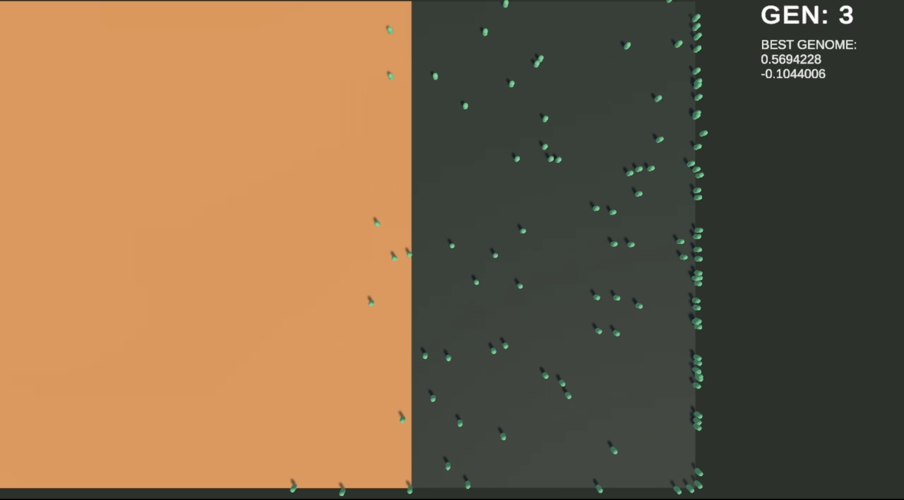

# Fire Avoidance AI Simulation

This project is an AI simulation developed in Unity where agents learn to avoid incoming fire from the left side. The agents have a genome consisting of horizontal and vertical movement inputs, ranging from -1 to 1. The goal of the agents is to minimize vertical movement as there is no advantage in going up or down due to the fire's direction, while averaging their horizontal movement towards 0.5 to effectively evade the fire.

## How It Works

- Agents: The agents in this simulation have the task of avoiding the fire that constantly approaches from the left side of the screen. The agents control their movement using horizontal and vertical inputs based on their genome.

- Genome: The genome of each agent contains two values, representing horizontal and vertical movement inputs. The agents learn through an evolutionary process to adjust these inputs for effective fire avoidance.

- Fitness Evaluation: The fitness of each agent is determined by their ability to avoid the fire and survive for as long as possible. Agents with higher survival times and more optimal movement patterns are considered fitter.

- Genetic Algorithm: The simulation employs a genetic algorithm to evolve the agents. The fittest agents are selected based on their survival time and movement patterns, and they become the parents of the next generation. Offspring are created through reproduction and inherit the genome of their parents, subject to slight random mutations.

  - Genome Selection : Average of parent's genome.
  - Mutation : any one of the gene is changed by +- 0.1

- Generations: The simulation progresses through multiple generations, with agents continuously learning and adapting to the fire's presence. Over time, agents tend to minimize vertical movement and adjust their horizontal movement to effectively avoid the fire.

## Getting Started

1. Clone the repository or download the source code.

2. Open the project in Unity.

   - used 2021.3.16f1

3. Run the simulation by entering Play mode.

4. Observe how the agents learn and adapt to avoid the incoming fire from the left side.

## Customization

- Fire Behavior: The behavior of the incoming fire can be adjusted, such as its speed.

- Agent Behavior: The movement behavior of the agents can be modified in the AgentController script to experiment with different movement strategies.

- Genetic Algorithm Parameters: The parameters of the genetic algorithm, including population size, selection criteria, mutation rate, and others, can be adjusted in the GameManager script to explore different evolutionary dynamics.

## Contributing

Contributions to the project are welcome! If you have any ideas, suggestions, or improvements, feel free to submit a pull request or open an issue.

## License

This project is licensed under the [MIT License](LICENSE).

## Acknowledgments

This project aims to showcase the capabilities of evolutionary algorithms in training agents to avoid danger effectively. It serves as a learning experiment and is not intended for production use.

README Generated with ChatGPT.
